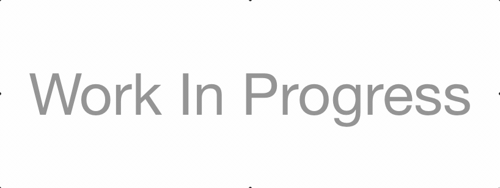

<!-- ### 👋🏿 Hi there -->

# Hi there, I'm Junior!

- 🔭 I’m currently working on data structures & algorithms
- 🌱 I’m currently learning python & typescript
- 👯 I’m looking to collaborate on open source projects
- 💬 Ask me about my favorite react library
- 😄 Pronouns: He/Him/His
- ⚡ Fun fact: I'm always in the mood for food

---

## About Me

<strong>Short Intro</strong>

  

    I'm a full-stack developer based out of Fort Lauderdale, FL. I love working with new technology, currently I enjoy working with JavaScript, ReactJS, NextJS, and NodeJS while also learning more about Python, React Native and TypeScript.
  

<strong>Long Intro</strong>

 
I'm a full-stack developer & graphic designer with an interest in full-stack web development and applications.

  
I've spent the last 18 months studying full stack javascript development at Lambda School while working full time. In their immersive program for part-time students, I learned Frontend & Backend Javascript, Complex State Management, API Development, Databases, Data Structures & Algorithms, and Computer Science among other topics.

  
Before becoming a full-stack developer, I always had interests in technologies, gadgets, and art. I graduated from Broward College in 2012 located in South Florida with a degree in Digital Multimedia. That’s where I was first introduced to web programming more specifically Adobe CS5 Flash & Actionscript 3.0, along with graphic & web design, 3D & motion graphics, and video editing.

  
When I'm not coding or designing, I'm usually watching anime, playing video games, or working up a sweat at a nearby park/gym.

  
Being a Bootcamp grad and having previous experience with design, customer service, and multimedia technologies, I bring a unique combination of skills to the table. I'm looking for a full-stack development position at a company that believes these skillsets can be valuable to their team.

  
If that sounds like you, feel free to reach out to me - I'm always happy to chat.

  
-Junior

---

## Projects

<table bordercolor="#24282D">
  <tr>
    <td width="33%" valign="top">
      <h3>Rick & Morty API</h3> 
      
<a target="_blank" href="https://github.com/JuniorDugue/rick-and-morty">Repo</a> | <a target="_blank" href="http://rick-and-morty.jrdugue.vercel.app/">Site</a>
 
      
      
<strong>rick and morty app built with next.js & framer motion using the rick & morty wiki api</strong>

    </td>
    <td width="33%" valign="top">
      <h3>gFg | goodie Foodie Galleries</h3> 
      
<a target="_blank" href="https://github.com/JuniorDugue/grid_gallery_app">Repo</a> | <a target="_blank" href="https://grid-gallery-app.vercel.app/gallery">Site</a>
 
      
      
<strong>Image Gallery app with React, CSS Grid, React Router and styled-components</strong>

    </td>
  </tr>
</table>

---

## 📈 My Github Stats

 

---

## 📲 Social Media

<!--
**JuniorDugue/JuniorDugue** is a ✨ _special_ ✨ repository because its `README.md` (this file) appears on your GitHub profile.
Here are some ideas to get you started:

- 🔭 I’m currently working on ...
- 🌱 I’m currently learning ...
- 👯 I’m looking to collaborate on ...
- 🤔 I’m looking for help with ...
- 💬 Ask me about ...
- 📫 How to reach me: ...
- 😄 Pronouns: ...
- ⚡ Fun fact: ...
-->
